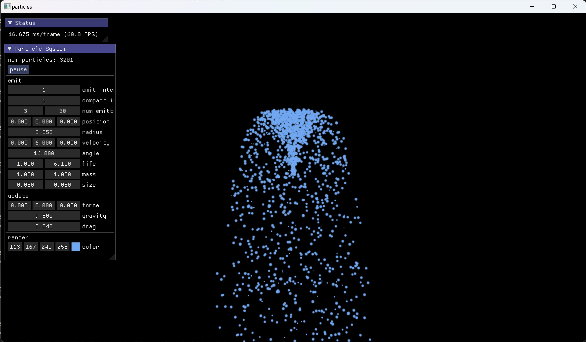

# OpenGL Particle System

A simple particle system implemented in OpenGL 4.6.

（Also project for Zhejiang University 2022-2023 Spring Computer Animation master course）

The application contains a single particle emitter, and some settings of the particle system can be set through the 'Particle System' panel.

## Build

CMake is used to build this project.

C++20 is needed.

`glslangValidator` should be in `PATH`.

## Used Thirdparty

* [glad](https://github.com/Dav1dde/glad)
* [glfw](https://github.com/glfw/glfw)
* [glm](https://github.com/g-truc/glm)
* [Dear ImGui](https://github.com/ocornut/imgui)
* [stb](https://github.com/nothings/stb)
* [cmrc](https://github.com/vector-of-bool/cmrc)

## Details

There are 4 main parts in the particle system:

* emit - Particles will be emitted every `emit_interval` frames. Each new particle has an random initial position and velocity, and the initial accelerator is zero. See `emit.comp`.
* update - Update particles using Verlet method. A force input from UI, gravity and drag force are considered. See `update.comp`.
* compact - Compact array of particles due to dead particles every `compact_interval` frames. A two-level scan on GPU is performed to compute the new indices in the array for each particle (see `scan1.comp`, `scan2.comp` and `scan3.comp`), and then living particles are copied to the new position (see `compact.comp`).
* draw - Render each particle as a billboard using instanced draw call. See `draw.vert` and `draw.frag`.

